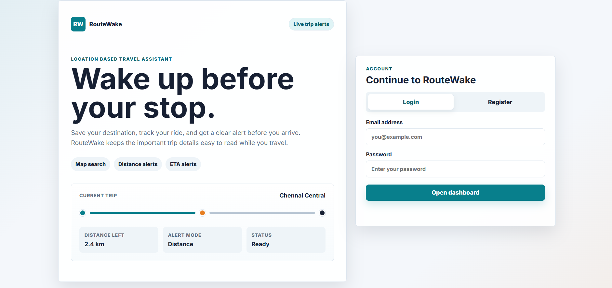

# RouteWake 

A Spring Boot web application that helps travelers avoid missing their stop —
track your live location, set a destination, and get alerted before you arrive.

---

## system.identity
~~~
name        : RouteWake
type        : full-stack web application
architecture: MVC (Spring Boot + Thymeleaf)
runtime     : Java 17+
status      : active
version     : 1.0.0
~~~

---

## system.overview
~~~
RouteWake solves a simple problem — missing your stop.
Users register, pick a destination on a live map, start
a trip monitor, and receive an alert when they are close
to their destination. Built on real GPS data with
distance and ETA based alert modes.
~~~

---

## system.visuals

---

## modules

### user.module
~~~
- account registration and login
- recent trip history
- session management
~~~

### map.module
~~~
- destination search via OpenStreetMap / Nominatim
- manual destination pinning on map
- live browser location tracking
- Leaflet.js + CARTO map tiles
~~~

### alert.module
~~~
- distance mode : alert when within selected kilometers
- ETA mode      : alert when arrival time hits selected minutes
- real-time monitoring via browser geolocation
~~~

### backend.module
~~~
- Spring Boot MVC architecture
- Thymeleaf templating engine
- JDBC database access layer
- Oracle database persistence
- REST API controllers
~~~

---

## tech.stack
~~~
language    : Java 17+
framework   : Spring Boot
frontend    : Thymeleaf, HTML, CSS, JavaScript
maps        : Leaflet.js, OpenStreetMap, CARTO
database    : Oracle XE (JDBC)
build       : Maven
~~~

---

## project.structure
~~~
src/main/java/com/locationalarm
├── config/         → Oracle connection configuration
├── controller/     → Page and REST API controllers
├── dto/            → Request DTOs
├── model/          → Domain models
├── repository/     → JDBC database access
├── service/        → Business logic
└── LocationAlarmApplication.java

src/main/resources
├── application.properties
├── schema.sql
├── static/
│   ├── css/
│   └── js/
└── templates/
~~~

---

## database.setup
~~~
1. start Oracle Database
2. create or use an existing Oracle user/schema
3. run schema file:
   src/main/resources/schema.sql
4. update credentials in:
   src/main/resources/application.properties
~~~

~~~
app.db.url=jdbc:oracle:thin:@localhost:1521:xe
app.db.username=your_username
app.db.password=your_password
~~~

---

## execution
~~~
mvn spring-boot:run
~~~

~~~
open → http://localhost:8081
port configured in → application.properties
~~~

---

## usage.flow
~~~
1. register or log in
2. search for a destination or pin it on the map
3. choose alert mode:
   distance → alert when within X kilometers
   ETA      → alert when arrival time hits X minutes
4. click start monitor
5. allow browser location permission
6. relax — RouteWake handles the rest
~~~

---

## system.notes
~~~
- browser location permission required for live tracking
- internet access required for map tiles and route lookup
- Oracle must be running for login, signup, and trip saving
- starting a new trip will replace the previous active trip
~~~

---

## current.state
~~~
- user authentication fully functional
- map and destination search operational
- live location tracking active
- distance and ETA alert modes working
- trip history saved to Oracle DB
~~~

---

## pending.upgrades
~~~
- push notifications for alerts
- mobile responsive improvements
- trip analytics dashboard
- offline map support
~~~
